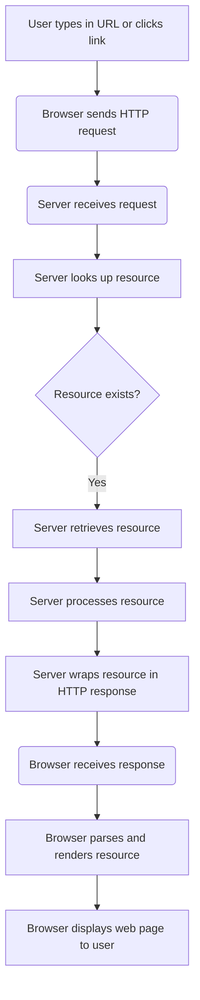

```mermaid
    graph TD;
    A[User types in URL or clicks link] -->|HTTP Request| B(Server);
    B -->|Check if resource exists| C{Resource Exists?};
    C -- Yes -->|Retrieve resource| D[Server retrieves resource];
    C -- No -->|Send 404 response| E[Server sends 404 Not Found];
    D -->|Process resource| F[Server processes resource];
    F -->|Wrap in HTTP response| G[Server wraps resource in HTTP response];
    G -->|HTTP Response| H(Browser);
    H -->|Parse and Render| I[Browser parses and renders resource];
    I -->|Display| J[Browser displays web page to user];
```


