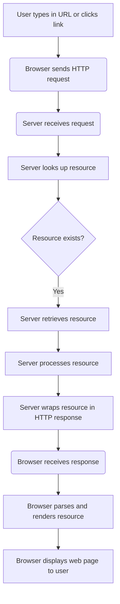

```mermaid
graph TD;
  A[User types in URL or clicks link] --> B(Browser sends HTTP request);
  B --> C(Server receives request);
  C --> D[Server looks up resource];
  D --> E{Resource exists?};
  E -- Yes --> F[Server retrieves resource];
  F --> G[Server processes resource];
  G --> H[Server wraps resource in HTTP response];
  H --> I(Browser receives response);
  I --> J[Browser parses and renders resource];
  J --> K[Browser displays web page to user];
```
