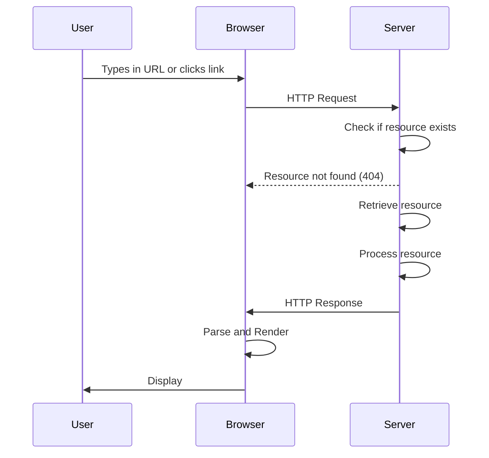

```mermaid

sequenceDiagram
  User ->> Browser: Types in URL or clicks link
  Browser->> Server: HTTP Request
  Server->> Server: Check if resource exists
  Server-->> Browser: Resource not found (404)
  Server->> Server: Retrieve resource
  Server->> Server: Process resource
  Server->> Browser: HTTP Response
  Browser->> Browser: Parse and Render
  Browser->> User: Display
```
