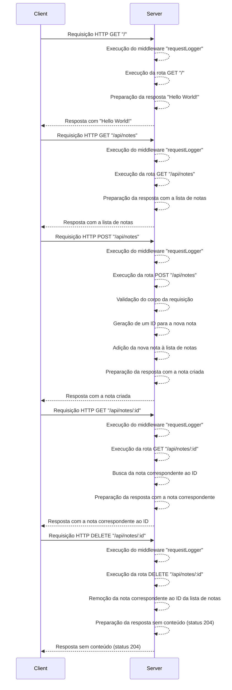

```mermaid
  sequenceDiagram
  Client ->> Server: Requisição HTTP GET "/"
  Server -->> Server: Execução do middleware "requestLogger"
  Server -->> Server: Execução da rota GET "/"
  Server -->> Server: Preparação da resposta "Hello World!"
  Server -->> Client: Resposta com "Hello World!"

  Client ->> Server: Requisição HTTP GET "/api/notes"
  Server -->> Server: Execução do middleware "requestLogger"
  Server -->> Server: Execução da rota GET "/api/notes"
  Server -->> Server: Preparação da resposta com a lista de notas
  Server -->> Client: Resposta com a lista de notas

  Client ->> Server: Requisição HTTP POST "/api/notes"
  Server -->> Server: Execução do middleware "requestLogger"
  Server -->> Server: Execução da rota POST "/api/notes"
  Server -->> Server: Validação do corpo da requisição
  Server -->> Server: Geração de um ID para a nova nota
  Server -->> Server: Adição da nova nota à lista de notas
  Server -->> Server: Preparação da resposta com a nota criada
  Server -->> Client: Resposta com a nota criada

  Client ->> Server: Requisição HTTP GET "/api/notes/:id"
  Server -->> Server: Execução do middleware "requestLogger"
  Server -->> Server: Execução da rota GET "/api/notes/:id"
  Server -->> Server: Busca da nota correspondente ao ID
  Server -->> Server: Preparação da resposta com a nota correspondente
  Server -->> Client: Resposta com a nota correspondente ao ID

  Client ->> Server: Requisição HTTP DELETE "/api/notes/:id"
  Server -->> Server: Execução do middleware "requestLogger"
  Server -->> Server: Execução da rota DELETE "/api/notes/:id"
  Server -->> Server: Remoção da nota correspondente ao ID da lista de notas
  Server -->> Server: Preparação da resposta sem conteúdo (status 204)
  Server -->> Client: Resposta sem conteúdo (status 204)
```
